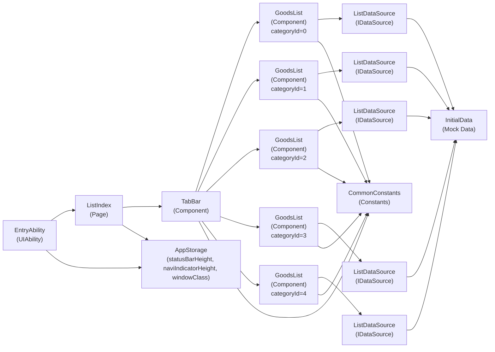
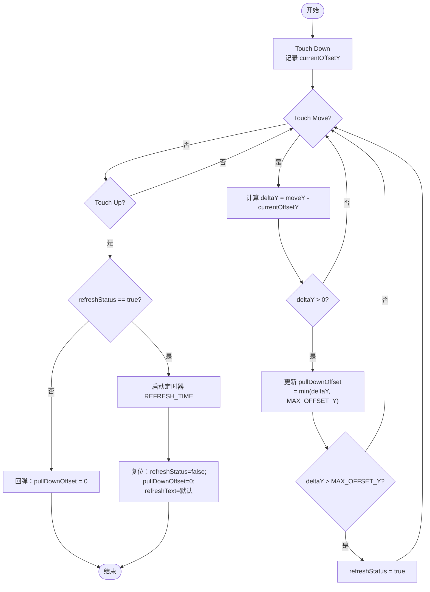
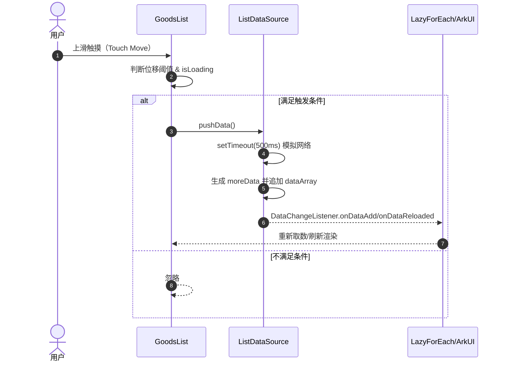
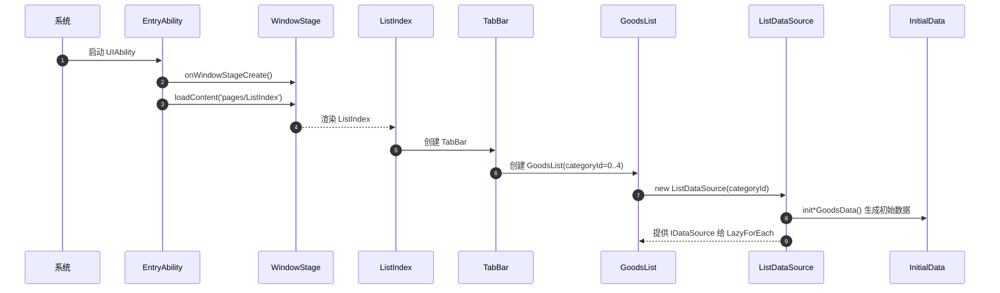

# 易购坊 Mall（Yigofang_Mall）架构设计文档

## 1.功能简介

- 页面：单页入口 `pages/ListIndex`。
- 功能：
  - 分类 Tabs 切换（“精选/手机/服装/穿戴/家居”）。
  - 商品列表 LazyForEach 懒加载渲染。
  - 下拉刷新：仅 UI 状态与回弹，模拟刷新，不请求真实数据。
  - 触底加载：基于 Touch Move 判断上滑触发，调用数据源追加数据（模拟网络延迟）。
- 数据：本地模拟数据（`InitialData.ets`），无真实网络、无持久化数据库。

## 2. 系统总体设计架构

### 2.1 分层架构（现状）

- 表现层（UI / Page / Components）
  - 页面：`ListIndex.ets`
  - 组件：`TabBarsComponent.ets`、`GoodsListComponent.ets`、`PutDownRefreshLayout.ets`
- 状态与数据层（ViewModel / DataSource）
  - 数据模型与初始化数据：`InitialData.ets`
  - 列表数据源（实现 IDataSource）：`ListDataSource.ets`
- 公共层（Common）
  - 常量/尺寸/文案引用：`CommonConstants.ets`
- 平台与运行时（HarmonyOS / ArkUI）
  - UIAbility：`EntryAbility.ets`
  - WindowStage、AppStorage 等系统能力

### 2.2 系统运行时流程概览

1. 系统启动 Ability：`EntryAbility`。
2. `onWindowStageCreate` 加载主页面：`pages/ListIndex`。
3. `ListIndex` 渲染导航容器并嵌入 `TabBar`。
4. `TabBar` 负责 Tabs 切换与下拉刷新状态控制；每个 Tab 内嵌一个 `GoodsList`。
5. `GoodsList` 为不同分类创建对应 `ListDataSource(categoryId)`，LazyForEach 使用该数据源渲染商品项。
6. 触底加载时，`GoodsList` 调用 `ListDataSource.pushData()` 模拟加载更多并通知 UI 更新。

### 2.3 构件图（UML - 构件/组件关系）

## 3. 各模块详细设计

### 3.1 入口模块：EntryAbility

- 职责：
  - 应用生命周期管理（onCreate/onForeground/onBackground 等）。
  - WindowStage 创建后加载主页面 `pages/ListIndex`。
  - 沉浸式适配：读取避让区域高度并写入 `AppStorage`：`statusBarHeight`、`naviIndicatorHeight`。

- 关键点：
  - 使用 `windowStage.loadContent('pages/ListIndex')` 加载页面。
  - 通过 `windowClass.setWindowLayoutFullScreen(true)` 设置全屏布局。

### 3.2 页面模块：ListIndex

- 职责：
  - 作为唯一入口页面容器。
  - 负责 Navigation 框架与页面顶层布局。
  - 从 `AppStorage` 读取 `statusBarHeight` 做顶部 padding，避免内容被状态栏遮挡。

- 组件结构：
  - `Navigation`（标题为 STORE）
  - `Column` -> `TabBar()`

### 3.3 组件模块：TabBar（分类标签页 + 下拉刷新）

- 职责：
  - 提供 Tabs 结构与 TabBar 文案/样式。
  - 管理下拉刷新状态（`refreshStatus`、`refreshText`、`pullDownOffset`）。
  - 监听触摸事件实现下拉刷新交互：
    - `Down` 记录起点
    - `Move` 更新偏移并判断阈值
    - `Up` 触发刷新或回弹

- 状态：
  - `@State tabsIndex: number`：当前 Tab 索引
  - `@State refreshStatus: boolean`：是否进入刷新状态
  - `@State refreshText: Resource`：刷新文案
  - `@State pullDownOffset: number`：下拉位移

- 约束（来自常量）：
  - `MAX_OFFSET_Y`：触发刷新阈值
  - `REFRESH_TIME`：刷新展示时间（模拟）

### 3.4 组件模块：GoodsList（商品列表 + 触底加载）

- 职责：
  - 根据 `@Prop categoryId` 创建/持有对应分类的数据源 `ListDataSource(categoryId)`。
  - 使用 `LazyForEach(IDataSource)` 渲染列表项。
  - 监听触摸上滑触发“加载更多”（模拟）：调用 `goodsListData.pushData()`。

- 数据源绑定：
  - `@Provide goodsListData: ListDataSource = new ListDataSource(this.categoryId)`

- 触底加载策略（现状）：
  - 通过 Touch Move 判断：`startTouchOffsetY - endTouchOffsetY > 100` 即视为上滑触发一次加载。
  - `isLoading` 防抖；500ms 后释放。

### 3.5 组件模块：PutDownRefresh（刷新指示器）

- 职责：显示刷新图标与文案。
- 输入：`@Link refreshText: Resource`，由父组件 `TabBar` 维护。

### 3.6 数据与 ViewModel：InitialData & ListDataSource

#### 3.6.1 数据模型（现状）

`GoodsListItemType` 字段：
- `id: number`：全局唯一（通过 `getNextGoodsId()` 递增）
- `goodsName: ResourceStr`
- `price: ResourceStr`
- `goodsImg: Resource`
- `advertisingLanguage: ResourceStr`
- `evaluate: ResourceStr`
- `category: number`：分类 ID（0-4）

#### 3.6.2 数据初始化（现状）

- `initGoodsData()/initMobilePhoneGoodsData()/...`：为不同分类生成 4~5 条商品数据。
- `shuffleArray()`：用于随机打乱商品展示顺序。

#### 3.6.3 列表数据源（现状）

`ListDataSource implements IDataSource`：
- `constructor(categoryId)`：按分类选择 init 函数初始化 `dataArray`。
- `totalCount()`：返回最大展示数量 `MAX_DATA_LENGTH`。
- `getData(index)`：
  - 接近末尾（`index >= length - 6`）时预加载更多。
  - 索引越界时返回最后一条（兜底）。
- `pushData()`：模拟延迟 500ms，生成追加数据并通知监听者 `onDataAdd/onDataReloaded`。
- `refreshData()`：模拟延迟 1000ms，重新生成并通知 `onDataReloaded`。

## 4. 接口设计

### 4.1 前端内部接口（组件/数据源）

#### 4.1.1 组件输入/输出约定

- `GoodsList`
  - 输入：`categoryId: number`（分类 ID）
  - 依赖：`ListDataSource(categoryId)`

- `PutDownRefresh`
  - 输入：`@Link refreshText: Resource`

- `TabBar`
  - 内部状态：`tabsIndex/refreshStatus/refreshText/pullDownOffset`
  - 输出：通过 UI 状态改变驱动子树刷新（ArkUI 响应式）

#### 4.1.2 IDataSource（LazyForEach）实现约定

- `totalCount(): number`
- `getData(index: number): GoodsListItemType`
- `registerDataChangeListener(listener: DataChangeListener): void`
- `unregisterDataChangeListener(listener: DataChangeListener): void`

## 5. 界面设计

### 5.1 页面结构

- 顶部：Navigation 标题（商城）
- 主体：Tabs（固定高度 barHeight=60）
- 每个 Tab 内容：
  - 下拉刷新区域（出现条件：`pullDownOffset>0` 或 `refreshStatus=true`）
  - Scroll 容器
  - 商品列表（GoodsList）

### 5.2 交互说明

- 分类切换：
  - Tabs `onChange` 更新 `tabsIndex`，并影响 TabBar 字体大小/颜色。

- 下拉刷新（模拟）：
  - 下拉位移 `pullDownOffset` 随手势变化，最大不超过 `MAX_OFFSET_Y`。
  - 抬起时若已超过阈值，则展示刷新状态 `REFRESH_TIME` 后复位。

- 加载更多（模拟）：
  - 在列表区域上滑（位移阈值 > 100）触发一次 `pushData()`。
  - `isLoading` 在 500ms 期间置为 true 并展示“正在加载更多...”。

## 6. UML 图表

### 6.1 活动图：下拉刷新流程（UML - Activity）

### 6.2 顺序图：触发加载更多（UML - Sequence）

### 6.3 顺序图：应用启动并进入首页（UML - Sequence）

