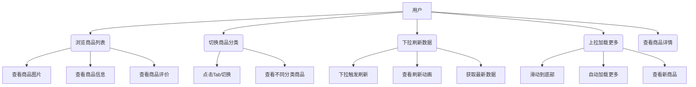
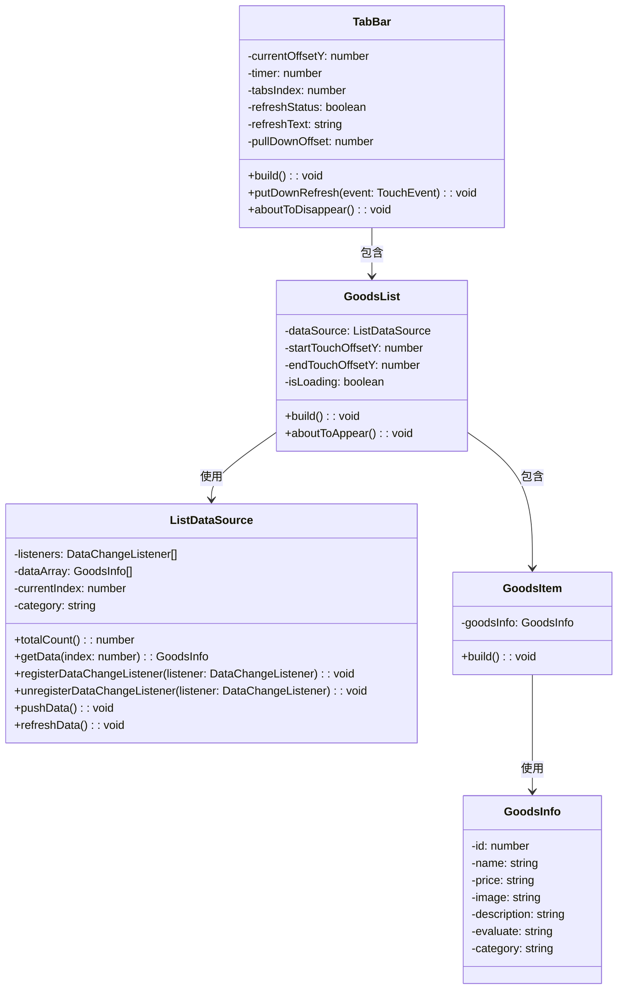
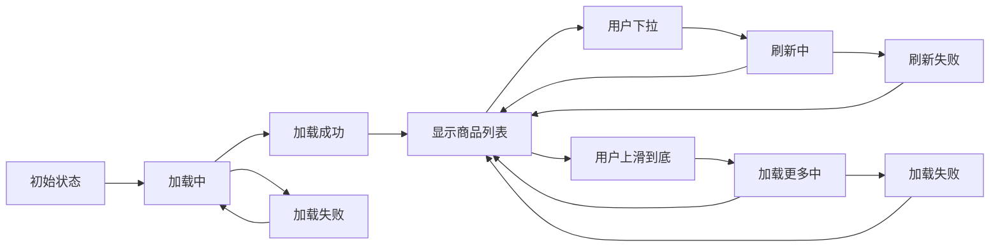

# 《移动互联网编程实践》课程大作业需求分析文档

## 一、项目概述

### 1.1 项目名称

HarmonyOS商城应用 - 商品浏览系统

### 1.2 项目背景

随着移动互联网的发展，电商应用成为人们日常生活的重要组成部分。本项目基于HarmonyOS Next操作系统，使用ArkTS语言开发一个轻量级商城应用，旨在让学生掌握移动端应用开发的核心技术，特别是列表渲染、数据懒加载、下拉刷新等关键技术。

### 1.3 项目目标

- 实现一个基本的商品浏览商城应用
- 掌握HarmonyOS应用开发流程
- 熟悉ArkTS语言和DevEco Studio开发工具
- 实践移动应用的核心交互模式

## 二、功能性需求

### 2.1 商品浏览模块

FR-001 商品列表显示：以列表形式展示商品信息，包括图片、名称、价格、评价等，优先级：高
FR-002 图片显示：显示商品缩略图，支持多种图片尺寸，优先级：高
FR-003 商品信息展示：显示商品名称、价格、评价、广告语等信息，优先级：高
FR-004 瀑布流布局：支持不同高度的商品卡片布局，优先级：中
FR-005 高矮图共存：支持不同比例的商品图片展示，优先级：中

### 2.2 分类导航模块

FR-006 顶部Tab导航：提供"精选"、"手机"、"服饰"、"穿搭"、"家居"五个分类，优先级：高
FR-007 Tab切换：点击Tab可切换到对应分类的商品列表，优先级：高
FR-008 Tab样式切换：当前选中Tab高亮显示，未选中Tab灰色显示，优先级：高
FR-009 分类数据隔离：不同分类显示不同的商品数据，优先级：中

### 2.3 性能优化模块

FR-010 懒加载(LazyForEach)：列表数据懒加载，提升长列表性能，优先级：高
FR-011 下拉刷新：向下滑动触发数据刷新，带动画效果，优先级：高
FR-012 触底加载更多：滑动到底部自动加载更多数据，优先级：高
FR-013 帧率优化：保持≥40fps帧率，中间不掉帧，优先级：中

### 2.4 交互体验模块

FR-014 列表滚动：商品列表支持上下滑动，优先级：高
FR-015 到底提示：滑动到底部显示"已经到底了"提示，优先级：中
FR-016 弹性效果：使用系统级弹簧效果实现回弹，优先级：中
FR-017 触摸事件处理：处理触摸事件实现下拉刷新和懒加载，优先级：高

## 三、非功能性需求

### 3.1 性能需求

NFR-001 响应时间：页面加载时间<2秒，验证方式：性能测试
NFR-002 滚动性能：列表滚动帧率≥40fps，验证方式：帧率测试
NFR-003 内存使用：应用内存占用<100MB，验证方式：内存监控
NFR-004 懒加载效率：剩余6条商品时预加载，验证方式：功能测试

### 3.2 可用性需求

NFR-005 界面一致性：所有页面保持统一的UI设计风格
NFR-006 操作便捷性：三步内找到目标品类
NFR-007 视觉反馈：所有交互操作都有明确的视觉反馈
NFR-008 错误提示：网络错误或数据异常时有明确的错误提示

### 3.3 兼容性需求

NFR-009 系统兼容：兼容HarmonyOS Next系统
NFR-010 屏幕适配：适配不同分辨率的鸿蒙设备
NFR-011 开发环境：使用DevEco Studio 4.0+开发

### 3.4 可靠性需求

NFR-012 网络异常处理：网络延迟时下拉刷新有合理的超时机制
NFR-013 数据一致性：刷新和加载更多时数据不丢失、不重复
NFR-014 应用稳定性：应用运行稳定，无明显崩溃现象

## 四、UML图表

### 4.1 用例图

用户作为主要参与者，可以通过系统进行以下操作：

- 浏览商品列表：查看商品图片、信息、评价
- 切换商品分类：点击Tab切换不同分类
- 下拉刷新数据：下拉触发刷新，查看最新商品
- 上拉加载更多：滑动到底部自动加载更多商品
- 查看商品详情：点击商品进入详情页（扩展功能）

### 4.2 类图

主要包含以下类：

- GoodsList：商品列表组件，负责渲染商品列表
- ListDataSource：数据源类，实现懒加载逻辑
- GoodsItem：商品项组件，展示单个商品信息
- GoodsInfo：商品数据模型，包含商品基本信息
- TabBar：标签页组件，实现分类导航

### 4.3 状态图

商品列表状态流转：

1. 初始状态 -> 加载中
2. 加载中 -> 加载成功（显示列表）或加载失败
3. 显示列表时，用户下拉 -> 刷新中 -> 刷新成功/失败
4. 显示列表时，用户上滑到底 -> 加载更多中 -> 加载成功/失败

## 五、系统约束

### 5.1 技术约束

- 开发语言：ArkTS
- 开发工具：DevEco Studio
- 运行环境：HarmonyOS Next真机/模拟器
- 组件要求：必须使用Scroll、List、Tabs、LazyForEach等HarmonyOS原生组件

### 5.2 时间约束

- 项目周期：1个月

### 5.3 资源约束

- 开发人员：项目组成员
- 硬件资源：个人电脑
- 测试设备：鸿蒙模拟器

## 六、假设和依赖

### 6.1 假设条件

1. 设备网络连接正常
2. 鸿蒙系统版本符合要求
3. 开发环境配置正确

### 6.2 外部依赖

1. HarmonyOS SDK
2. DevEco Studio开发工具
3. 鸿蒙设备或模拟器
4. 课程提供的代码框架

## 七、验收标准

### 7.1 功能验收标准

| 功能项 | 验收标准 | 测试方法 |
|--------|----------|----------|
| 商品列表 | 正确显示商品图片、名称、价格等信息 | 视觉检查 |
| Tab切换 | 点击Tab能正确切换到对应分类 | 功能测试 |
| 懒加载 | 滑动时能按需加载数据，不卡顿 | 性能测试 |
| 下拉刷新 | 下拉能触发刷新并有动画效果 | 功能测试 |
| 触底加载 | 滑动到底部自动加载更多数据 | 功能测试 |

### 7.2 性能验收标准

| 性能指标 | 验收标准 | 测试工具 |
|----------|----------|----------|
| 帧率 | ≥40fps | DevEco Profiler |
| 内存占用 | <100MB | 系统监控工具 |
| 响应时间 | <2秒 | 手动测试 |

## 八、风险分析

| 风险编号 | 风险描述 | 可能性 | 影响程度 | 应对措施 |
|----------|----------|--------|----------|----------|
| R-001 | 兼容性问题 | 中 | 高 | 多设备测试，及时适配 |
| R-002 | 性能问题 | 中 | 高 | 代码优化，使用懒加载 |
| R-003 | 技术难点 | 中 | 中 | 查阅文档，寻求指导 |
| R-004 | 测试设备不足 | 低 | 低 | 使用模拟器补充测试 |

