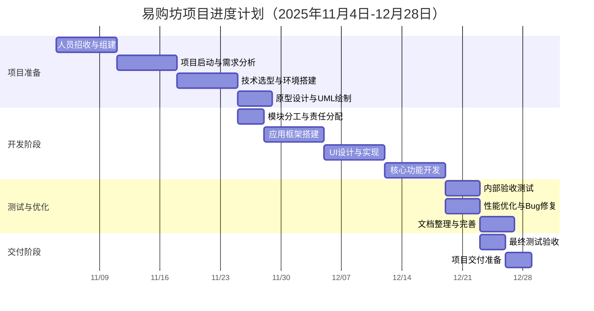

# 《易购坊》HarmonyOS商城应用项目管理文档

## 1. 项目概述

### 1.1 项目基本信息
- **项目名称**：易购坊 - HarmonyOS商城应用
- **项目周期**：2025年11月3日 - 2025年12月28日（2个月）
- **团队成员**：4人
- **技术栈**：HarmonyOS + ArkTS + ArkUI + DevEco Studio

### 1.2 项目目标
在2个月时间内，开发一个运行于HarmonyOS Next真机/模拟器上的沉浸式商城应用，实现商品浏览、分类、搜索、筛选等核心功能，确保交互流畅、视觉美观，帧率稳定在≥40fps。

## 2. 项目团队与分工

### 2.1 团队组织结构
项目组组长组长：沈嘉乐
技术开发组：姚宇翔、徐泓昊、谭天喆

### 2.2 成员职责分工

| 成员姓名 | 学号 | 角色 | 主要职责 | 负责模块 |
|---------|------|------|---------|---------|
| 沈嘉乐 | 22348229 | 项目经理 | 项目总体管理、进度跟踪与验收、效果优化 | 项目协调、测试计划、性能优化、文档审核 |
| 姚宇翔 | 23336287 | 前端架构师 | 应用框架搭建、导航架构、基础页面 | 首页框架、Tabs导航、页面路由、基础组件 |
| 徐泓昊 | 23336017 | UI开发工程师 | 页面细化、组件开发、UI实现 | 商品列表页面、商品卡片组件、样式设计 |
| 谭天喆 | 23336219 | 功能开发工程师 | 核心功能实现、性能优化 | 数据懒加载、下拉刷新、筛选功能、搜索功能 |

### 2.3 具体分工说明

#### 2.3.1 第一阶段：应用框架搭建（姚宇翔）
- 搭建HarmonyOS应用基础架构
- 实现`Navigation`导航框架
- 创建5个基础页面模板（首页、分类、搜索、筛选、个人中心）
- 配置路由管理和页面跳转逻辑
- 建立基础UI组件库和样式规范

#### 2.3.2 第二阶段：页面细化与UI实现（徐泓昊）
- 将空白页面细化为具体的商品列表页面
- 设计并实现商品卡片组件模板
- 统一页面样式和视觉规范
- 优化页面交互细节

#### 2.3.3 第三阶段：核心功能实现（谭天喆）
- 集成商品数据源和本地模拟数据
- 实现`LazyForEach`懒加载功能
- 开发下拉刷新和触底加载功能
- 实现商品筛选和排序功能
- 开发搜索功能接口和结果展示

#### 2.3.4 阶段性检验：测试与优化（沈嘉乐）
- 制定测试计划和执行测试
- 监控应用性能指标（帧率、内存、响应时间）
- 优化应用性能和用户体验
- 协调项目进度和风险管理

## 3. 项目计划与进度安排

### 3.1 项目里程碑计划

| 里程碑 | 时间节点 | 主要交付物 | 负责人 |
|--------|---------|-----------|--------|
| M1: 人员招收 | 第1周 | 项目组团队名单 | 全员 |
| M2: 项目启动 | 第3周 | 项目计划书、需求确认 | 沈嘉乐 |
| M2: 模块分工 | 第4周 | 成员分工责任表 | 全员 |
| M4: 框架完成 | 第5周 | 应用基础框架、5个页面 | 姚宇翔 |
| M5: UI完成 | 第6周 | 完整UI界面、组件库 | 徐泓昊 |
| M6: 功能完成 | 第7周 | 所有核心功能实现 | 谭天喆 |
| M7: 内部验收 | 第7周 | 测试评估、性能优化 | 沈嘉乐 |
| M8: 项目交付 | 第8周 | 完整应用、所有文档 | 全员 |

### 3.2 详细进度安排

## 4. 进度跟踪与监控

### 4.1 跟踪机制
- **每周汇报**：每周末，总结本周工作，规划下周任务
- **里程碑评审**：每个里程碑节点进行成果评审，全员对当前完成度进行评估
- **代码审查**：每周末进行代码审查，确保代码质量

### 4.2 进度跟踪记录表

| 会议日期 | 参会人员 | 本周完成 | 下周计划 | 遇到的问题 | 解决方案 |
|---------|---------|---------|---------|-----------|---------|
| 2025-11-18 | 全员 | 项目启动、需求确认 | 环境搭建、原型设计 | 无 | 无 |
| 2025-11-25 | 全员 | 环境搭建完成、原型初稿 | 框架搭建开始 | DevEco Studio配置问题 | 参考官方文档解决 |
| 2025-12-02 | 全员 | 基础框架搭建中 | 完成框架、开始UI设计 | Navigation使用不熟练 | 组织专题学习 |
| 2025-12-08 | 全员 | 框架完成、开始UI设计 | 完成页面基础布局 | 页面间传参问题 | 使用ViewModel解决 |
| 2025-12-15 | 全员 | UI设计完成、开始功能开发 | 实现懒加载功能 | 数据源结构不清晰 | 重构数据模型 |
| 2025-12-22 | 全员 | 懒加载完成、开始下拉刷新 | 完成所有核心功能 | 下拉刷新动画卡顿 | 优化动画实现方式 |
| 2025-12-25 | 全员 | 所有功能完成、开始测试 | 性能优化、文档整理 | 帧率不稳定 | 使用Profiler分析优化 |
| 2025-12-28 | 全员 | 测试完成、优化完成 | 最终验收准备 | 部分机型兼容性问题 | 多设备测试调整 |

### 4.3 项目指标跟踪

| 指标类别 | 指标名称 | 目标值 | 当前值 | 状态 |
|---------|---------|-------|-------|------|
| 进度 | 总体进度 | 100% | 跟踪中 | - |
| 质量 | 代码缺陷率 | <5% | 跟踪中 | - |
| 质量 | 测试通过率 | 100% | 跟踪中 | - |
| 性能 | 应用帧率 | ≥40fps | 跟踪中 | - |
| 性能 | 页面加载时间 | <2s | 跟踪中 | - |

## 5. 风险管理

### 5.1 风险识别与评估

| 风险编号 | 风险描述 | 可能性 | 影响程度 | 风险等级 | 应对策略 |
|---------|---------|--------|---------|---------|---------|
| R-001 | HarmonyOS API变更 | 中 | 高 | 高 | 1. 关注官方更新 2. 使用稳定版本API 3. 预留适配时间 |
| R-002 | 性能达不到要求 | 中 | 高 | 高 | 1. 早期性能测试 2. 使用性能分析工具 3. 代码优化 |
| R-003 | 团队成员技能不足 | 中 | 中 | 中 | 1. 组织技术培训 2. 代码评审 3. 经验分享 |
| R-004 | 项目进度延迟 | 中 | 中 | 中 | 1. 制定详细计划 2. 定期进度检查 3. 资源调配 |
| R-005 | 测试设备不足 | 低 | 低 | 低 | 1. 使用模拟器 2. 借用设备 3. 云测试平台 |
| R-006 | 需求变更 | 低 | 中 | 中 | 1. 需求确认流程 2. 变更评估 3. 文档更新 |

## 6. 沟通管理

### 6.1 沟通计划

| 沟通对象 | 沟通内容 | 频率 | 方式 | 负责人 |
|---------|---------|------|------|-------|
| 团队成员 | 任务进度、技术问题 | 每日 | 微信群 | 沈嘉乐 |
| 团队成员 | 周工作总结、下周计划 | 每周 | 微信群 | 沈嘉乐 |
| 团队成员 | 代码审查、技术讨论 | 每周 | 代码评审会 | 全员 |
| 课程老师 | 项目进展、问题咨询 | 按需 | 邮件/会议 | 沈嘉乐 |
| 所有干系人 | 里程碑成果展示 | 里程碑节点 | 演示会议 | 全员 |

### 6.2 沟通工具
- **项目管理**：GitHub Projects
- **代码管理**：Git
- **文档协作**：Markdown + GitHub Wiki
- **即时通讯**：微信
- **会议工具**：腾讯会议

## 7. 质量管理

### 7.1 质量目标
- 代码质量：零严重缺陷，代码规范遵守率100%
- 性能质量：帧率≥40fps，内存占用<100MB
- 功能质量：需求实现率100%，测试通过率100%
- 文档质量：文档完整率100%，格式规范率100%

### 7.2 质量控制措施

#### 7.2.1 代码质量
- 制定编码规范并强制执行
- 代码审查制度（每周一次）
- 单元测试覆盖率要求（核心模块>80%）
- 使用静态代码分析工具

#### 7.2.2 测试策略
1. **单元测试**：开发者自测，覆盖核心逻辑
2. **集成测试**：模块间接口测试，确保协同工作
3. **系统测试**：完整功能测试，模拟用户场景
4. **性能测试**：帧率、内存、响应时间测试
5. **兼容性测试**：不同设备、系统版本测试

#### 7.2.3 测试计划

| 测试阶段 | 测试类型 | 测试内容 | 测试时间 | 负责人 |
|---------|---------|---------|---------|-------|
| 开发阶段 | 单元测试 | 单个组件/功能 | 开发过程中 | 各开发者 |
| 集成阶段 | 集成测试 | 模块间接口 | 每周五 | 各开发者 |
| 系统测试 | 功能测试 | 完整业务流程 | 第7-8周 | 沈嘉乐 |
| 系统测试 | 性能测试 | 帧率、内存等 | 第8周 | 全员 |
| 验收测试 | 用户验收 | 用户体验测试 | 第8周 | 全员 |

## 8. 配置管理

### 8.1 版本控制策略
- **分支策略**：采用Git Flow工作流进行版本管理，由于该项目较小，分支管理策略简化
  - `main`分支：稳定版本分支，仅存放可发布的稳定版本
  - `feature/*`分支：功能开发分支
- **版本命名规范**：采用语义化版本控制
  - 格式：`v主版本.次版本.修订版本`
  - 示例：`v1.0.0`（初始版本）、`v1.1.0`（新增功能）、`v1.1.1`（修复bug）

### 8.2 代码管理规范
1. **提交规范**：
   - 每次提交必须有明确的提交信息
   - 提交信息格式：`类型(范围): 描述`
   - 类型包括：feat（新功能）、fix（修复bug）、docs（文档）、style（样式）、refactor（重构）、test（测试）、chore（构建/工具）

2. **代码审查**：
   - 所有代码合并请求必须经过至少一名团队成员审查
   - 审查重点：代码规范、功能实现、性能影响、测试覆盖

3. **依赖管理**：
   - 明确记录所有第三方依赖的版本
   - 定期检查依赖更新和安全漏洞

### 8.3 文档管理
- **文档结构**：所有文档采用Markdown格式，按类别组织
- **版本控制**：重要文档（需求、设计、测试）需进行版本控制
- **变更管理**：文档更新需经过评审，记录变更历史

### 8.4 环境配置
- **开发环境**：DevEco Studio 4.0+，HarmonyOS SDK 5.0+
- **测试环境**：HarmonyOS Next模拟器，兼容性测试设备
- **构建配置**：统一的构建脚本和配置文件

## 9. 交付物清单

### 9.1 文档类交付物
| 文档名称 | 文件格式 | 内容说明 | 提交状态 |
|---------|---------|---------|---------|
| 项目申请书 | DOCX/PDF | 项目背景、目标、技术方案等 | 已提交 |
| 需求分析文档 | Markdown | 功能性/非功能性需求、UML图表 | 已完成 |
| 架构设计文档 | Markdown | 系统架构、模块设计、数据库设计等 | 已完成 |
| 项目管理文档 | Markdown | 项目计划、分工、进度跟踪、风险管理 | 本文档 |
| 系统测试文档 | Markdown | 测试计划、测试用例、测试结果 | 已完成 |

### 9.2 代码类交付物
| 文件/目录 | 内容说明 | 提交状态 |
|-----------|---------|---------|
| `src/main/ets/` | ArkTS源代码目录 | 已完成 |
| `src/main/resources/` | 资源文件目录 | 已完成 |
| `build.gradle` | 构建配置文件 | 已完成 |
| `oh-package.json5` | 项目依赖配置 | 已完成 |
| 可执行应用 | HarmonyOS应用安装包 | 已完成 |

### 9.3 团队管理类交付物
| 交付物 | 内容说明 | 提交状态 |
|--------|---------|---------|
| 团队成员分工说明 | 组长提供的详细分工说明 | 已完成 |
| 个人实践心得（沈嘉乐） | 400字以内个人总结 | 已完成 |
| 个人实践心得（姚宇翔） | 400字以内个人总结 | 已完成 |
| 个人实践心得（徐泓昊） | 400字以内个人总结 | 已完成 |
| 个人实践心得（谭天喆） | 400字以内个人总结 | 已完成 |